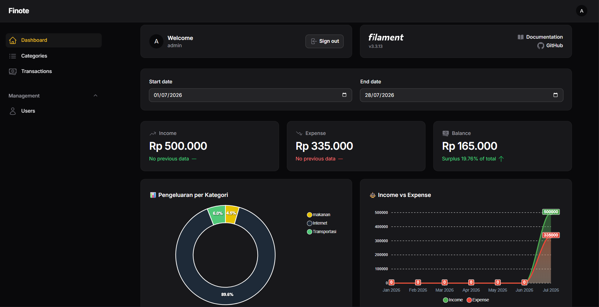
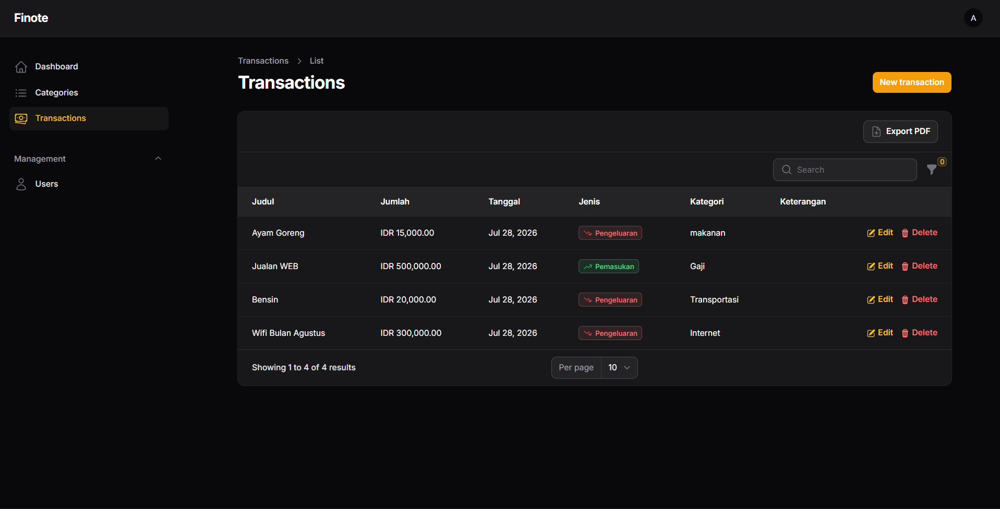
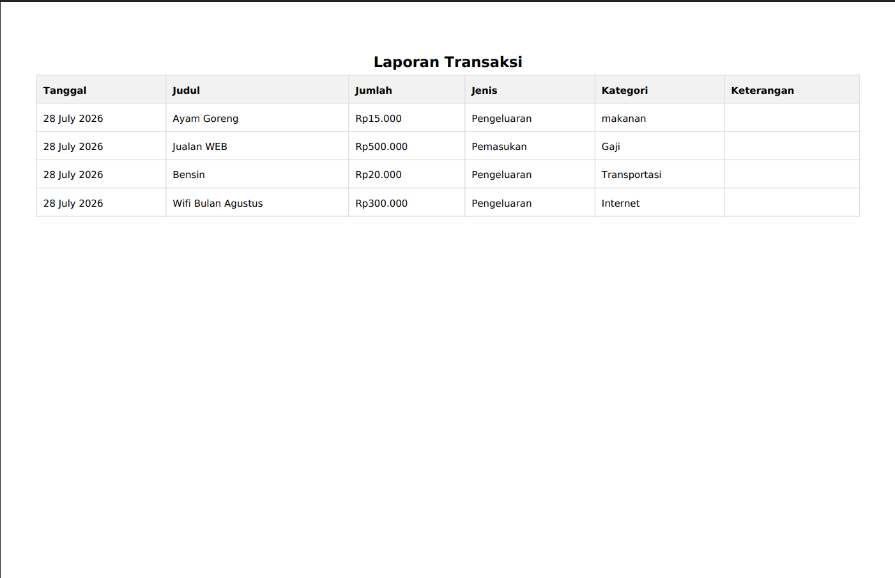

<div align="center">
  <h1>💰 Finote</h1>
  <p>Personal Finance Management Application</p>

  
  
  
  
</div>

---

## 📌 About

Finote is a personal finance management application that helps users track their income and expenses efficiently. It's built with Laravel as the backend API and admin panel, with a companion Flutter mobile app consuming the same REST API.

## 📸 Screenshots

| Dashboard | Transactions |
|---|---|
|  |  |

| PDF Export |
|---|
|  |

## ✨ Features

- 🔐 Authentication (Register, Login, Logout)
- 💸 Transaction Management (Income & Expense)
- 🗂️ Category Management
- 📊 Admin Panel powered by Filament
- 📄 PDF Export for transactions
- 🌐 REST API for mobile integration

## 🛠️ Tech Stack

**Backend**
- PHP 8.3
- Laravel 12
- Laravel Sanctum (API authentication)
- Filament 3 (admin panel)

**Database**
- MySQL

**Mobile**
- Flutter — by [ahmadabdillah001](https://github.com/ahmadabdillah001)

## ⚙️ Installation

```bash
# Clone repo
git clone https://github.com/Athallahsy/finote.git
cd finote

# Install dependencies
composer install

# Copy environment file
cp .env.example .env

# Generate app key
php artisan key:generate

# Configure your database in .env, then run migrations
php artisan migrate --seed

# Start the server
php artisan serve
```

<details>
<summary>💡 Local frontend asset compilation (optional)</summary>

To prevent deployment platforms from misdetecting this as a Node.js project, the Node config files are renamed by default. If you want to compile frontend assets locally, rename these files first:

- `package.json.local` → `package.json`
- `package-lock.json.local` → `package-lock.json`
- `vite.config.js.local` → `vite.config.js`

Then run `npm install` and `npm run dev` as usual.

</details>

## 🔑 API Endpoints

| Method | Endpoint | Description | Auth |
|--------|----------|-------------|------|
| POST | `/api/register` | Register a new user | ❌ |
| POST | `/api/login` | Log in | ❌ |
| POST | `/api/logout` | Log out | ✅ |
| GET | `/api/transactions` | List all transactions | ✅ |
| POST | `/api/transactions` | Create a transaction | ✅ |
| PUT | `/api/transactions/{id}` | Update a transaction | ✅ |
| DELETE | `/api/transactions/{id}` | Delete a transaction | ✅ |
| GET | `/api/categories` | List all categories | ✅ |

## 📄 License

This project is licensed under the [MIT License](LICENSE).

## 👨‍💻 Developer

**Athallah Muhammad Syaffa**
- GitHub: [@Athallahsy](https://github.com/Athallahsy)
- Portfolio: [athallahsy.github.io/portofolio](https://athallahsy.github.io/portofolio)
